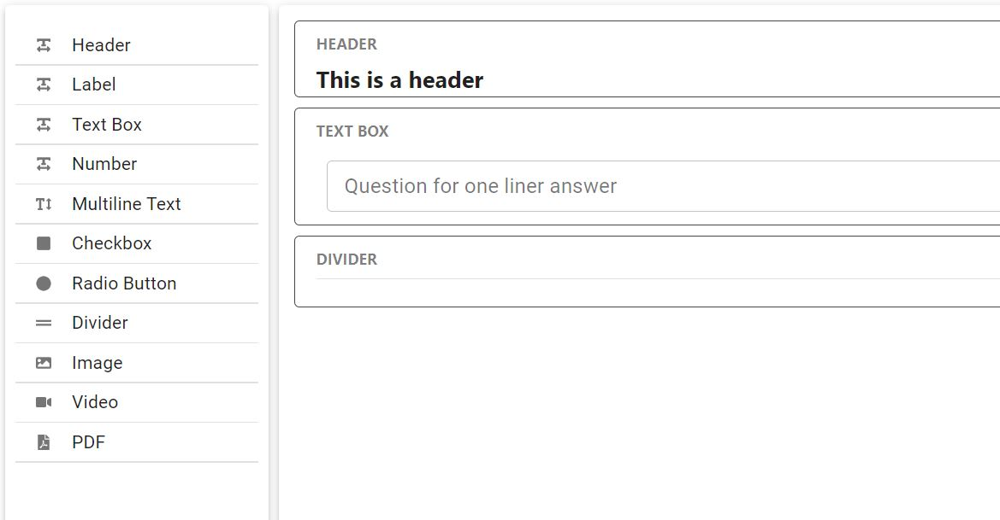

<h1  align="center">react-form-planner <small>(WIP)</small></h1>

This is a **fully customizable** form builder based on [`React`](https://facebook.github.io/react/)

Key features

 - Tons of prebuilt controls
 - Custom controls
 - Custom style
 - Drag and Drop
 - Custom template

 ***THIS IS "WORK IN PROGRESS"***

## Screen shots

 ## Core characteristics

## Collaborators 🤝

- Koustov [@koustov](https://twitter.com/IAmTrySound)
- And waiting
