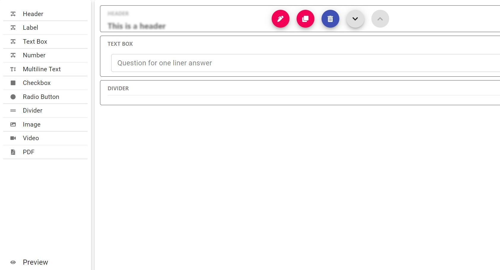
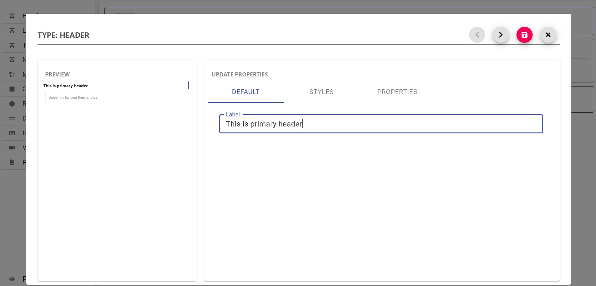
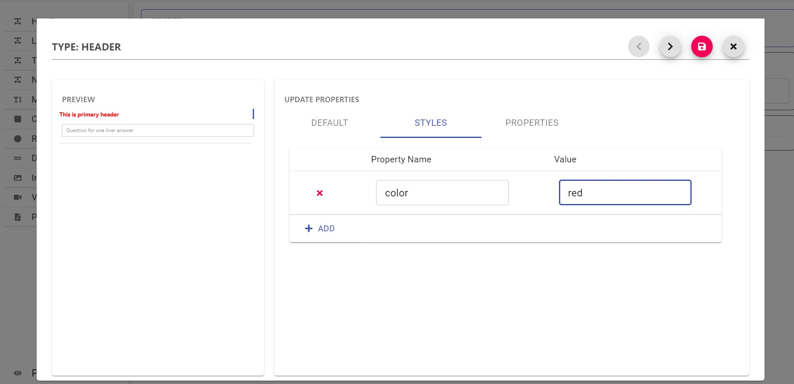

<h1  align="center">react-form-planner <small>(WIP)</small></h1>

This is a **fully customizable** form builder based on [`React`](https://facebook.github.io/react/)

Key features

 - Tons of prebuilt controls
 - Custom controls
 - Custom style
 - Drag and Drop
 - Custom template

 ***THIS IS "WORK IN PROGRESS"***

## Screen shots

 # Core characteristics

# 🏷️ License
Copyright © 2021 by [Koustov](https://github.com/koustov)

This project is licensed under MIT license.

# ⭐ Show your support
If you liked the work, please show your support by giving a Star!

This project follows the [all-contributors](https://github.com/all-contributors/all-contributors) specification. Contributions of any kind welcome!

