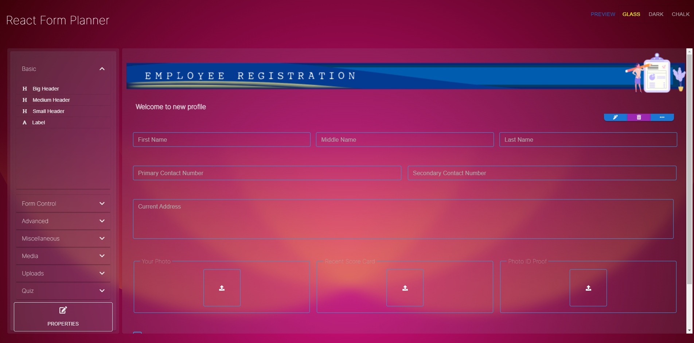
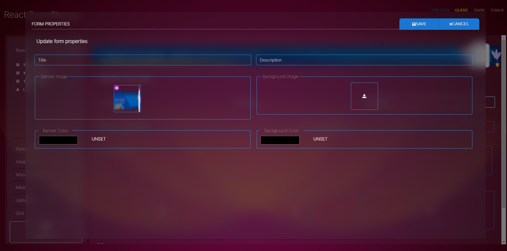
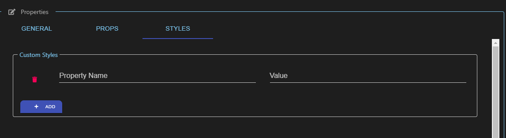
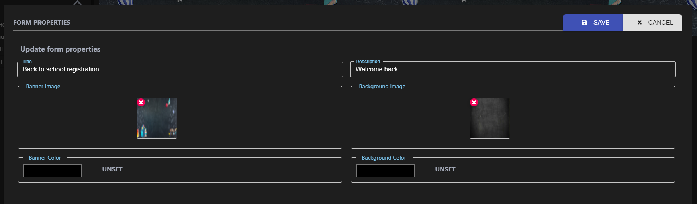

<div align="center">
   <p>
    <h1>rfp-react-form-builder</h1>
    <h4>Formally knows as react-form-planner</h1>
  </p>
  <p>
     <i>Build or view, your beautiful form is just a click away.</i>
     <br/>
     <i>No technical knowledge is required.</i>
     <br/>
     <b>NO BACKEND,Entirely based on frontend.</b>
  </p>

  <p>

  </p>
</div>

---

   

This is a **fully customizable** form builder based on [`React`](https://facebook.github.io/react/)

**Table of Contents**

- [Screenshots](#screenshots)
- [Demo](#demo)
- [Playground](#playground)
- [Features](#features)
- [When do you need it](#when-do-you-need-it)
- [Usage](#usage)
  - [Install 🐙](#install-)
- [Highlight 🔥](#highlight-)
  - [Form Builder](#form-builder)
  - [How to use](#how-to-use)
  - [Supported Elements](#supported-elements)
  - [Form Properties](#form-properties)
  - [Form Parameters](#form-parameters)
  - [Preview your form](#preview-your-form)
  - [Form Viewer](#form-viewer)
  - [How to use](#how-to-use-1)
- [Playground](#playground-1)
- [Items in queue](#items-in-queue)
- [Contribution 🍰](#contribution-)
- [License](#license)

## Screenshots

|                                          |                                              |
| ---------------------------------------- | -------------------------------------------- |
|  |  |
|     |      |

## Demo

Visit https://rfp-react-form-planner.vercel.app/

## Playground

Visit https://codesandbox.io/s/rfp-react-form-planner-smw51

## Features

- JSON based.
- Redux based.
- Fully Responsive
- Customizable
- Quick and easy.
- Styled component based.
- Theme supported
- Full validation support
- Custom theme

## When do you need it

- You have complex form to be created?
- Forms are dynamic in nature?
- You don't want to manage the form?
- You need a structured/organised form rendering?
- You are providing forms as service

## Usage

- Simple Form
- Dynamic Form
- Quiz
- Exams
- Tutorial
- Sky is the only limit

### Install 🐙

```bash
npm install rfp-react-form-planner @fortawesome/fontawesome-svg-core @fortawesome/fontawesome-svg-core @fortawesome/react-fontawesome react-player styled-components @mui/material
``` 

or

```bash
yarn add rfp-react-form-planner @fortawesome/fontawesome-svg-core @fortawesome/fontawesome-svg-core @fortawesome/react-fontawesome react-player 
```

## Highlight 🔥

This project contains an advanced Form Builder and a Form Viewer.

### Form Builder

- Capable of creating form of any type.
- Styled component theme support
- Endlesss Customization
- Add your own style
- Add your own properties

### How to use

Import FormPlanner component

```jsx
import { FormPlanner } from 'react-form-viewer'
```

Just drop it to desired place

```jsx
<FormPlanner
  onControlValueChanged={() => {
    console.log('onControlValueChanged')
  }}
  onFormValueChanged={() => {
    console.log('onFormValueChanged')
  }}
  theme={dark}
/>
```

### Supported Elements

FormPlanner comes with tons of prebuilt elements which are already grouped for convenience. Few of them are visible by default. Rest can be turned on when required

| Group         | Element               | Internal Name | Availability |
| ------------- | --------------------- | ------------- | ------------ |
| Basic         | Header                | header        | Default      |
|               | Medium Header         | mediumheader  | Default      |
|               | Small Header          | smallheader   | Default      |
|               | Label                 | label         | Default      |
| Form Control  | Text Box              | text          | On Demand    |
|               | Number Box            | number        | On Demand    |
|               | Multiline Box         | multiline     | On Demand    |
|               | Date Picker           | date          | On Demand    |
|               | Date Time Picker      | datetime      | On Demand    |
|               | Checkbox              | checkbox      | On Demand    |
|               | Radio                 | radio         | On Demand    |
|               | Select                | select        | On Demand    |
|               | Color Picker          | color         | On Demand    |
| Media         | Image                 | image         | On Demand    |
|               | Video                 | video         | On Demand    |
|               | PDF                   | pdf           | On Demand    |
| Quiz          | Question              | question      | On Demand    |
| Advanced      | Grid                  | grid          | On Demand    |
|               | Rich Text             | richtext      | On Demand    |
|               | Multi Values          | multivalue    | On Demand    |
| Uploads       | Image Upload          | imageupload   | On Demand    |
|               | Multiple Image Upload | imagesupload  | On Demand    |
| Miscellaneous | Divider               | divider       | On Demand    |

### Form Properties

Allows to add/update form meta information like

- Title
- Description
- Header background image
- Header background color
- Background image
- Background color
  

### Form Parameters

| Name               | Description                                             | Default Value |
| ------------------ | ------------------------------------------------------- | ------------- |
| showFormProperties | Show form properties button to update form level values | false         |
| showPreview        | Integrated button to show form preview                  | false         |
| allowCustomStyles  | Allow user to set custom css styles                     | false         |
| allowCustomProps   | Allow user to set custom field properties               | false         |
| advancedFeatures   | Enable advanced features                                | false         |
| fields             | List of control types to be shown                       | All           |

### Preview your form

Preview your form while editing

### Form Viewer

This is a full fledged form viewer.

- Capable of rendering complex form layout.
- Multi line and multi row
- Theme support

### How to use

Import FormPlanner component

```jsx
import { FormPlanner } from 'react-form-viewer'
```

Just drop it to desired place

```jsx
<FormViewer
  onChange={(a, b, c) => {
    console.log('Value received')
  }}
  template={<template_data>}
/>
```

## Playground

Getting built

## Items in queue

- Localization

## Contribution 🍰

Feel free to create issue and make pull request

Refer [code of conduct ](./CODE_OF_CONDUCT.md)

Refer [contributing ](./CONTRIBUTING.md)

## License

MIT © [Koustov](https://github.com/koustov)
